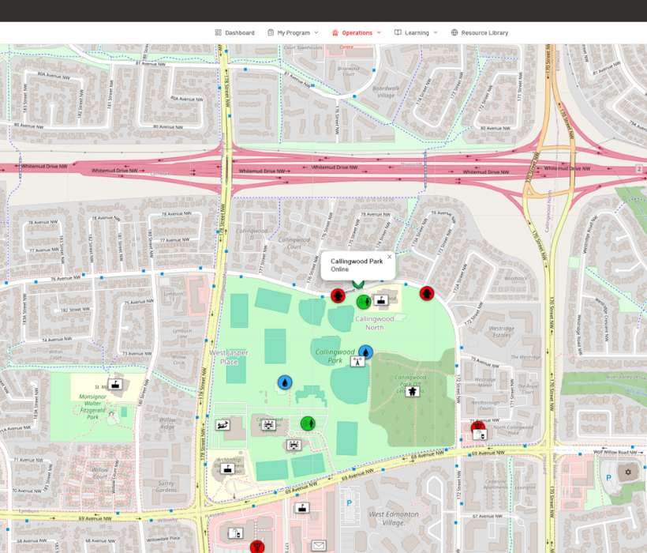
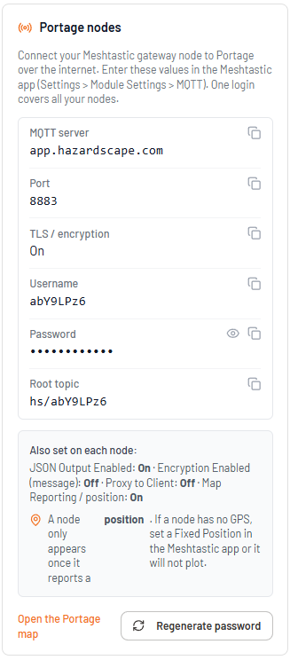
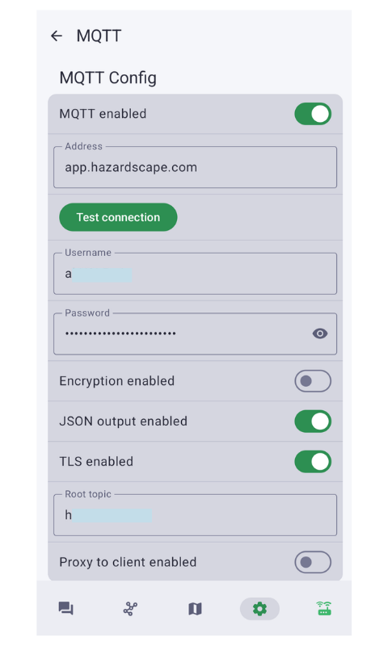
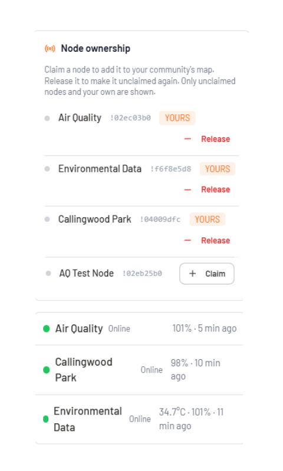

# Connecting a Meshtastic Node to Portage

<!--
  IMAGES: create an `images/` folder next to this README in your repo and commit your PNGs there.
  The relative paths below (images/xxx.png) will then render on GitHub. Replace each placeholder
  with your actual screenshot - the alt text and caption on each describe what to capture.
-->

A plain-language guide for getting your Meshtastic nodes onto your community's **Portage** map and claiming them to your community. No coding required.

Portage is the off-grid mapping and community-assets capability of the Hazardscape emergency management platform [Hazardscape emergency management platform](https://hazardscape.com). Once a node is connected, it appears as a live marker on your community's map with its name, last-seen time, battery, position, and any sensor readings (temperature, air quality, and more).

> This guide is written to be shared with community members. It covers the **cloud** connection path: your gateway node connects to the Portage broker over the internet (TLS-encrypted). Each community has its own login and its own private topic, so your nodes stay separate from every other community.

  
   <em>Live nodes on a community's Portage map.</em>

---

## Contents

- [What this lets you do](#what-this-lets-you-do)
- [What you need](#what-you-need)
- [Connection settings](#connection-settings)
- [Step 1 - Get into Portage (free)](#step-1---get-into-portage-free)
- [Step 2 - Put the node on Wi-Fi](#step-2---put-the-node-on-wi-fi)
- [Step 3 - Point the node at the Portage broker (MQTT)](#step-3---point-the-node-at-the-portage-broker-mqtt)
- [Step 4 - Make sure the node has a position](#step-4---make-sure-the-node-has-a-position)
- [Step 5 - See it on the map](#step-5---see-it-on-the-map)
- [Step 6 - Claim the node (community admin)](#step-6---claim-the-node-community-admin)
- [Troubleshooting](#troubleshooting)
- [Good to know](#good-to-know)
- [Helpful links](#helpful-links)
- [Support](#support)

---

## What this lets you do

Connect a Meshtastic node so it appears as a live marker on your community's Portage map. Your community admin then **claims** the node so it belongs to your community. This is part of the free Portage and Community Assets features.

---

## What you need

- **At least one "gateway" node** - a Meshtastic device with Wi-Fi (an ESP32 board such as a Heltec or T-Beam). The gateway is the node that talks to the Portage broker over Wi-Fi.
- **Sensor / field nodes (optional)** - other Meshtastic nodes relay their data to the gateway over LoRa, so only the gateway needs Wi-Fi. A single gateway is enough to start.
- **A 2.4 GHz Wi-Fi network** the gateway can join that can reach the internet. ESP32 radios do **not** support 5 GHz Wi-Fi.
- **The [Meshtastic app](https://meshtastic.org/docs/software/)** on your phone, to configure the node over Bluetooth.
- **A Portage login**, and to claim nodes, a **community admin** account.

---

## Connection settings

Your gateway connects to the Portage cloud broker over TLS. Your community's **username, password, and root topic** are shown in the app: sign in as the community admin, open your **community profile** (or the Portage map), and find the **"Portage nodes"** card. Copy the values from there.

| Setting | Value |
|---|---|
| MQTT broker address | `app.hazardscape.com` |
| Port | `8883` |
| TLS / encryption to the server | **ON** |
| Username | from the Portage nodes card |
| Password | from the Portage nodes card |
| Root topic | `hs/<your code>` (from the Portage nodes card) |

> Each community has its own login and its own root topic (`hs/<your code>`), so your nodes are kept separate from every other community. One login covers all of your nodes. Portage runs its own broker - never point your nodes at the public `mqtt.meshtastic.org` broker. The connection to `app.hazardscape.com:8883` is protected by TLS; your gateway only needs normal internet access (any 2.4 GHz Wi-Fi that reaches the internet).

  
   <em>The "Portage nodes" card in your community profile - copy these values into the Meshtastic app.</em>

---

## Step 1 - Get into Portage (free)

1. Go to your Portage sign-in page and **join / create your account** (it is free).
2. One person becomes the **community admin** (Hazardscape approves this). Other members then join that same community by invite.
3. Sign in. From the menu, open **Portage** to see your community's map, and **Community Assets** to map shelters, water, and other resilience assets.

---

## Step 2 - Put the node on Wi-Fi

In the Meshtastic app, connect to your node over Bluetooth, then open **Settings > Network**:

- **Wi-Fi:** enable it and choose your **2.4 GHz** network; enter the password.
- **IPv4 Mode:** leave on **DHCP** if your router assigns addresses automatically (recommended). Use **STATIC** only if you were given a fixed IP, gateway, and subnet.
- Save. The node reboots and joins Wi-Fi.

---

## Step 3 - Point the node at the Portage broker (MQTT)

In the Meshtastic app, open **Settings > Module Settings > MQTT** and enter the values from the settings table above:

- **MQTT Server / Address:** `app.hazardscape.com` (use port `8883` if the app asks)
- **Username / Password:** from the Portage nodes card
- **TLS / Encryption to server (root CA):** **ON** (Portage uses port 8883 with TLS)
- **Encryption Enabled (message encryption):** **OFF** (leave the channel unencrypted so the decoded JSON can be read; the TLS above still protects the connection)
- **JSON Output Enabled:** **ON** (required - Portage reads the JSON feed)
- **Root topic:** `hs/<your code>` (copy the exact value from the Portage nodes card)
- **Proxy to Client Enabled:** **OFF**
- **Map Reporting / position broadcast:** **ON**, so the node reports where it is

Save. The node reboots and starts publishing. Your gateway needs current Meshtastic firmware for TLS MQTT to work reliably.

  
   <em>MQTT module settings in the Meshtastic app (Settings &gt; Module Settings &gt; MQTT).</em>

---

## Step 4 - Make sure the node has a position

A node only appears on the map once it reports a **position**.

- If the node **has GPS**, make sure GPS / position is enabled and it has a fix (outdoors helps).
- If the node has **no GPS** (many indoor gateway boards do not), set a **Fixed Position** in the Meshtastic app (**Settings > Position > Fixed Position**) and enter its latitude and longitude. Without a fixed position, a GPS-less node will connect but will **not** show on the map.

---

## Step 5 - See it on the map

1. In Portage, open the **Portage** map.
2. Within a few minutes your node should appear as a marker (name, battery, last-seen).
3. New nodes may start **unclaimed** or in a default bucket until an admin claims them (Step 6).

> Nodes that go silent for more than **24 hours** drop off the map automatically, and reappear the next time they report in.

---

## Step 6 - Claim the node (community admin)

Claiming makes the node belong to your community's map. **Only a community admin can claim.**

1. Sign in as the **community admin** and open the **Portage** map.
2. Find the **Node ownership** panel (in the side rail / drawer on the Portage page). Members who are not community admins will not see this panel - ask your admin.
3. If you administer more than one community, pick the right community from the selector.
4. Next to your node (identified by its name and its `!` id), click **Claim**. The node moves onto your community's map.
5. To hand a node back, click **Release** - it becomes unclaimed again.

Only unclaimed nodes and your own community's nodes are listed, so you can never claim another community's node.

  
   <em>The Node ownership panel - Claim moves a node onto your community's map.</em>

---

## Troubleshooting

**Node does not appear on the map**
- Confirm the gateway is on **2.4 GHz** Wi-Fi and actually connected (the Meshtastic app shows its IP).
- Confirm **JSON Output = ON** and the **Root topic** exactly matches the `hs/<your code>` value on the Portage nodes card.
- Confirm the node has a **position** (GPS fix, or a Fixed Position set - see Step 4).
- Confirm the broker **address, port, username, and password** match the settings table.
- Give it a few minutes after saving; the node reboots and then reports in.

**Node shows up but in the wrong / no community**
- Have your community admin **Claim** it (Step 6).

**Node disappeared**
- If it has been offline more than 24 hours it drops off automatically; it returns when it reports again.

---

## Good to know

- Your gateway connects to Portage over **TLS on port 8883**, so the link is encrypted. Never point nodes at the public `mqtt.meshtastic.org` broker - use `app.hazardscape.com` so your data stays with Portage.
- Sensor and gateway nodes are optional to the map - you can also add community assets and markers by hand in Portage and Community Assets without any hardware.
- Your node and map data belong to your community. Claiming and releasing nodes, and who can see them, stay under your community's control.

---

## Helpful links

- [Meshtastic project](https://meshtastic.org) - firmware, hardware, and the mobile apps
- [Meshtastic MQTT module docs](https://meshtastic.org/docs/configuration/module/mqtt/) - full detail on the Step 3 settings
- [Hazardscape / Portage](https://hazardscape.com) - about the platform

---

## Support

Questions or need a hand getting a node connected? Contact **support@hazardscape.com**.

Learn more about Portage and the Hazardscape platform at **[hazardscape.com](https://hazardscape.com)**.
